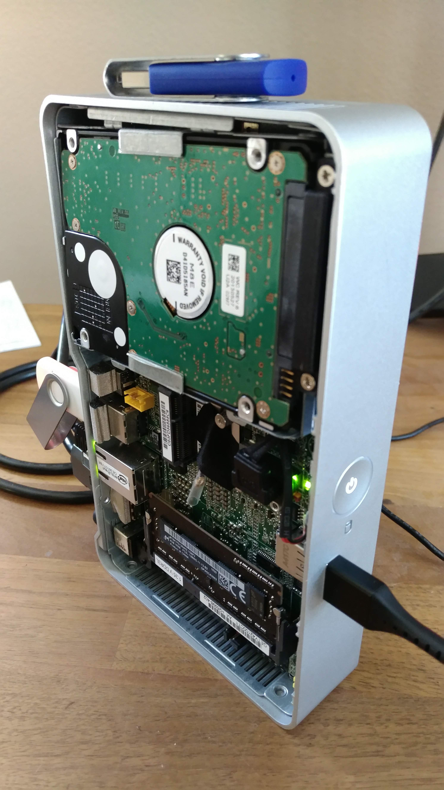

# Intel NUC Samba Server

<p align="center">

</p>

## Motive and Background

This is my documentation on how to install a small linux OS that solves the
following needs:

- Must serve as a hardened SSH endpoint for a remote LAN
- Must fit onto the SSD boot drive (4G!) of an Intel NUC DE3815TYKE
- Must automatically mount an attached 2.5" SATA drive
- SATA drive must be used for storage and storage only
  - This means no OS files on the SATA drive

Having toiled with many different distros and versions, I encountered some
common issues:

- I was able to install the OS on the SATA drive, but the NUC refused to boot
    it (weird characters on boot that hung forever)
    - Every variation of general hanging with unreadable characters and no
        error messages to go on
- USB live ISOs that would boot and install fine on the SATA drive and then
    subsequently refuse to boot (see above)
- Installations that would work (!) but be so short on space they wouldn't
    allow the above requirements on the 4G parititon

I tried the following distros:

- The crazy and now seemingly unfindable custom ISO of ubuntu that Intel made
    for this thing (worked when it shipped, now who knows where it is)
- Ubuntu server 14LTS, 16LTS, 18LTS, and 19LTS
  - All the above install fine and then refuse to boot
- Arch linux 19.x
  - Installed fine and booted about a year ago and then ran out of space
  - Installed fine recently but refused to boot (boot loop)

Finally I went down a bit of an internet hole and came upon busybox, which
I had worked with before in docker images. I didn't know it could be run
on-metal, and it turns out alpine is the thing to do just that. The alpine
iso is just shy of 700MB, boots quickly, and is super, super easy to set up. No
GUI or ncurses - just straight up terminal with very easy prompts. Don't even
need to mess with fdisk - it sizes up swap and /dev and /home and all that for
you by default - nice!

Totally installed with samba, ssh (openssh, not dropbear), tmux, sudo, and my keys loaded I'm tipping
the scales at about 725MB with a comfy 1.7GB to spare on my NUC SSD. Much much
nicer than the arch install that left about 250MB left over even with just
openssh installed. Nice! And it looks like it's got a nice selection of mirrors
and a package manager, `apk` at your disposal. Not sure why more people don't
like alpine.

## Installation

#### Download Alpine

Just go [here](https://alpinelinux.org/downloads/) and select 'standard' for x86 (tested on alpine-standard-3.10.2-x86.iso).
Needed a USB stick that is 700MB or bigger. Burned with a machine running `sudo
gnome-fdisk`. Use the legacy boot mode for the NUC (UEFI may work but I haven't
tried). Was running kernel 4.19.67-0-vanilla i686.

#### Install Alpine

Loosely following [these instructions](https://wiki.alpinelinux.org/wiki/Install_to_disk), boot from the USB and run `setup-alpine` and follow the prompts. DHCP will work for the installer but not work when you boot into the installed system.

#### Networking

- When booted into the sytem, modify `/etc/network/interfaces` as below:

    ```
    iface eth0 inet static
            hostname myhostname
            address 192.168.1.2
            netmask 255.255.255.0
            gateway 192.168.1.1
    ```

#### Format the Hard Drive

- Delete any partitions on the existing drive
    ```
    fdisk /dev/sda
    ```

    Followed by
    p: print existing partitions
    d: delete existing paritions
    t: set type of new parition (83 for ext4 compatible)
    w: write the changes to disk

- Reboot the machine (can't format the disk til you do)
- Format the partition

    ```
    mkfs.ext4 /dev/sda1
    ```
- Add mount to /etc/fstab

    ```
    /dev/sda1   /mnt/storage  ext4  rw,relatime 0 3
    ```
- Set permissions of the new mount

    ```
    chmod 0777 /mnt/storage
    ```

#### [Samba Installation](https://wiki.alpinelinux.org/wiki/Setting_up_a_samba-server)

- Install samba

    ```
    apk add samba
    ```

- Set up `/etc/samba/smb.conf`

    ```
    [global]
      workgroup = WORKGROUP
      dos charset = cp850
      unix charset = ISO-8859-1
      force user = greg

    [storage]
      browseable = yes
      writeable = yes
      path = /mnt/storage
    ```

- Set up the new user

    ```
    adduser greg
    ```

- Set up the samba password for that user

    ```
    smbpasswd -a greg
    ```

- Restart the samba service

    ```
    rc-update add samba
    rc-service samba start
    ```

#### SSH

- Install sudo with `apk add sudo`
- Add user to sudoers file with `visudo` (run as root)
- Add the following to the bottom:

    ```
    greg ALL=(ALL) ALL
    ```

- Copy keys onto the server of course, for the `greg` account
- Uncomment the HostKey line

    ```
    HostKey /etc/ssh/ssh_host_rsa_key
    ```

- Disable root login with ssh

    ```
    sudo vi /etc/ssh/sshd_config
    ```

- Find ChallengeResponseAuthentication and set to no

    ```
    ChallengeResponseAuthentication no
    ```

- Find PasswordAuthentication set to no

    ```
    PasswordAuthentication no
    ```

- Find UsePAM and set to no

    ```
    UsePAM no
    ```

- Find PermitRootLogin and set to no

    ```
    PermitRootLogin no
    ```

- Restrict ciphers (add to the end of the file)

    ```
    KexAlgorithms curve25519-sha256@libssh.org
    Ciphers chacha20-poly1305@openssh.com,aes256-gcm@openssh.com,aes128-gcm@openssh.com,aes256-ctr,aes192-ctr,aes128-ctr
    MACs hmac-sha2-512-etm@openssh.com,hmac-sha2-256-etm@openssh.com,umac-128-etm@openssh.com
    ```

- Save and close the file. Reload the ssh server

    ```
    # /etc/init.d/sshd reload
    ```

- Verify everything's working (will return nothing if everything is ok)

    ```
    sudo sshd -t
    ```

- Add your pubkey to authorized keys

    ```
    cat ~/.ssh/id_rsa.pub >> ~/.ssh/authorized_keys
    ```


#### [Hardening](https://medium.com/@jasonrigden/hardening-ssh-1bcb99cd4cef)

- Follow [these steps](https://medium.com/@jasonrigden/hardening-ssh-1bcb99cd4cef)
    - Change banner
    - Change MOTD
    - Regenerate moduli (takes about 1.5h for the first command, and 15h for
        the second one)

- Finally, when you're done, run the security audit from the above medium link
    to ensure your ciphers and such are in order
